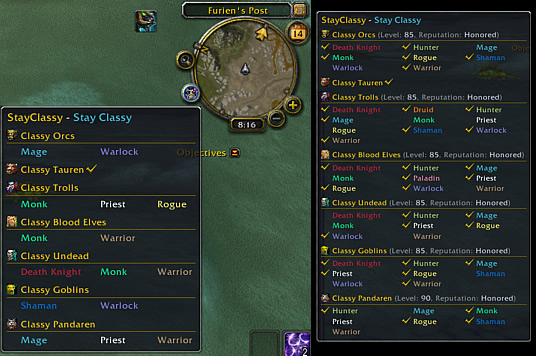
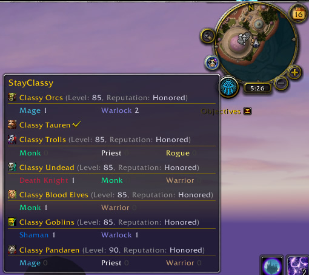
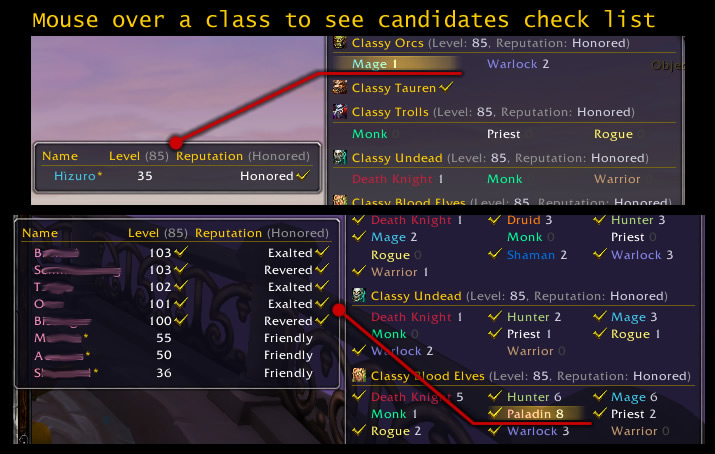

# StayClassy (WoW AddOn)

&nbsp; &nbsp; &nbsp; &nbsp;

## Description
This addon provides an easier overview for the guild achievement "Stay Classy".

A list of all classes and races in a single tooltip. Move the mouse over a race entry and a second tooltip let you see more. A check list of members with level and guild reputation.

## Bug reports, feature requests and Support
* [Bug reports & feature requests on Github](https://github.com/HizurosWoWAddOns/StayClassy/issues)
* [Comments & Criticism on Curseforge](https://www.curseforge.com/wow/addons/stayclassy)

## Localization
Do you want to help translate this addon?
See [Curseforge localization tool](https://www.curseforge.com/wow/addons/stayclassy/localization)

## Hizuro's projects
* On [Curseforge](https://www.curseforge.com/members/hizuro_de/projects)
* On [Github](https://github.com/HizurosWoWAddOns)

## Disclaimer
> World of Warcraft© and Blizzard Entertainment© are all trademarks or registered trademarks of Blizzard Entertainment in the United States and/or other countries. These terms and all related materials, logos, and images are copyright © Blizzard Entertainment.
